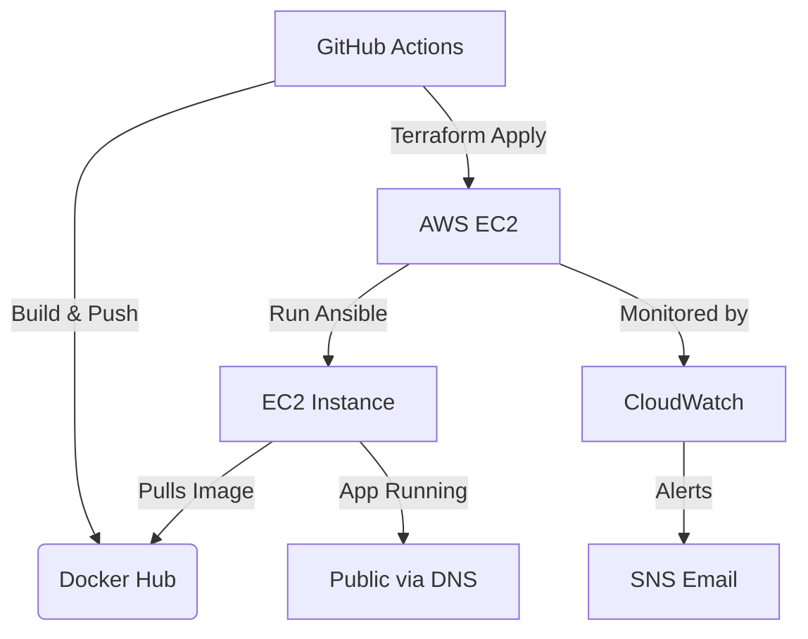

# Project Documentation

## Overview

This project automates the deployment of a Dockerized Flask application to AWS EC2 using Terraform, Ansible, and GitHub Actions. It supports both development and production environments, with infrastructure as code, CI/CD, and monitoring via AWS CloudWatch and SNS notifications.

---

## Directory Structure

```
.
├── ansible/
│   └── playbook.yml
├── docker-compose.yml
├── Dockerfile
├── .dockerignore
├── .github/
│   └── workflows/
│       ├── development.yml
│       └── production.yml
├── LICENSE
├── README.md
├── requirements.txt
├── src/
├── terraform/
│   ├── dev/
│   │   ├── backend.tf
│   │   └── variables.tf
│   └── prod/
│       ├── backend.tf
│       ├── main.tf
│       └── variables.tf
└── tests/
```

---

## Infrastructure as Code: Terraform

### Environments

- **Development**: `terraform/dev/`
- **Production**: `terraform/prod/`

Each environment has its own `backend.tf` (for remote state in S3) and `variables.tf` (for environment-specific variables).

### Key Resources

- **VPC, Subnet, and Internet Gateway**: Isolated networking for the application.
- **Route Table**: Enables internet access for the subnet.
- **Security Group**: Allows HTTP (80) from anywhere and SSH (22) from a restricted CIDR.
- **EC2 Instance**: Ubuntu 24.04, type configurable (default: `t3.micro`).
- **Elastic IP**: Static public IP for the EC2 instance.
- **Key Pair**: For SSH access, public key passed via variable.
- **Route53 DNS Records**: Points root and www domain to the EC2's Elastic IP.

#### Example: `terraform/prod/main.tf`
```hcl
resource "aws_vpc" "vpc" { ... }
resource "aws_subnet" "subnet" { ... }
resource "aws_internet_gateway" "igw" { ... }
resource "aws_route_table" "rtb" { ... }
resource "aws_security_group" "sg" { ... }
resource "aws_instance" "ec2_instance" { ... }
resource "aws_eip" "eip" { ... }
data "aws_route53_zone" "selected" { ... }
resource "aws_route53_record" "www" { ... }
resource "aws_route53_record" "root" { ... }
```

#### State Management

- **S3 Backend**: State is stored in an S3 bucket (`botit-terraform-state-eu`) with DynamoDB for state locking.

---

## Configuration Variables

Each environment defines:

- `project_name_prefix`
- `domain_name`
- `vpc_cidr`
- `subnet_az`
- `subnet_cidr`
- `instance_type`
- `ssh_cidr_block`
- `ssh_public_key` (passed via CI/CD secrets)

---

## CI/CD: GitHub Actions

### Workflow: `.github/workflows/production.yml`

#### Triggers

- On `pull_request` to `main`
- Manual dispatch

#### Jobs

1. **Build and Push Docker Image**
   - Lint and auto-fix Python code (`flake8`, `autopep8`)
   - Build Docker image and push to Docker Hub (`latest` and timestamped tag)

2. **Deploy**
   - Setup AWS credentials and Terraform
   - `terraform init` and `terraform apply` in the `prod` directory
   - Retrieve EC2 public IP and security group ID
   - Temporarily allow the GitHub Actions runner's IP for SSH
   - Install Ansible and run `ansible/playbook.yml` to configure the EC2 instance
   - Revoke SSH access from runner IP after deployment

#### Secrets Required

- `DOCKERHUB_USERNAME`, `DOCKERHUB_PASSWORD`
- `AWS_ACCESS_KEY_ID`, `AWS_SECRET_ACCESS_KEY`, `AWS_REGION`
- `SSH_PUBLIC_KEY`, `SSH_PRIVATE_KEY`

---

## Configuration Management: Ansible

### Playbook: `ansible/playbook.yml`

- Updates apt cache
- Installs Docker
- Ensures Docker service is running
- Adds `ubuntu` user to the `docker` group
- Runs the Flask app container from Docker Hub, mapping port 80 to 5000
- Writes a success log to `/var/log/ansible_docker_setup.log`

---

## Monitoring & Alerts

- **AWS CloudWatch**: Monitors EC2 instance metrics (CPU, memory, etc.)
- **CloudWatch Alarms**: Notifies via SNS to your email about health issues or other events.

---

## Usage

### 1. Clone the repository

```bash
git clone https://github.com/KhaledEl-Sman/toy-flask-app.git
cd toy-flask-app
```

### 2. Configure Secrets

Add required secrets to your GitHub repository.

### 3. Push Changes

CI/CD will automatically build, deploy, and configure your app.

---

## Running Locally with Docker Compose

After cloning the repository, you can start the application locally using Docker Compose. This will build and run the containers defined in the `docker-compose.yml` file.

To run the containers in **detached mode** (in the background), use the following command from the root directory of the project:

```bash
docker-compose up -d
```

This command will start all services defined in the compose file in the background, allowing you to continue using your terminal without being attached to the container logs[2][5][7].

### Additional Useful Commands

- To see the running containers:

  ```bash
  docker ps
  ```

- To view logs of a specific service (e.g., `web`):

  ```bash
  docker-compose logs -f web
  ```

- To stop and remove containers, networks, and volumes created by `up`:

  ```bash
  docker-compose down
  ```

---

## DockerHub Image URL

```bash
https://hub.docker.com/repository/docker/elsman2020/toy-flask-app
```

---
## Notes

- **SSH Access**: Only temporarily open for the GitHub Actions runner during deployment.
- **DNS**: Your domain must be managed in Route53.
- **Docker Image**: Update `image:` in the Ansible playbook if your Docker Hub repo changes.

---

## Diagram



---

## References

- [Terraform AWS Provider](https://registry.terraform.io/providers/hashicorp/aws/latest/docs)
- [Ansible Docker Module](https://docs.ansible.com/ansible/latest/collections/community/docker/docker_container_module.html)
- [GitHub Actions](https://docs.github.com/en/actions)
- [AWS CloudWatch](https://docs.aws.amazon.com/cloudwatch/)
